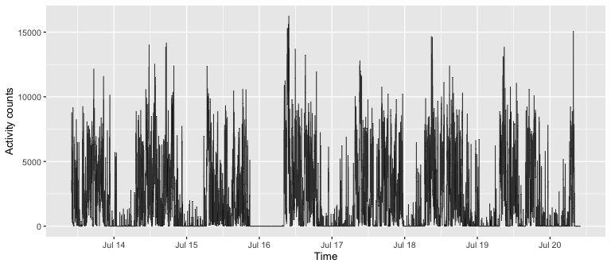

arctools
================

  - [Installation](#installation)
  - [Documentation](#documentation)
  - [Using `arctools` package to compute physical activity
    summaries](#using-arctools-package-to-compute-physical-activity-summaries)
      - [Reading PA data](#reading-pa-data)
      - [Computing summaries with `activity_stats`
        method](#computing-summaries-with-activity_stats-method)
      - [Output explained](#output-explained)
  - [Additional`activity_stats` method
    options](#additionalactivity_stats-method-options)
      - [Summarizing PA within a fixed set of minutes
        only](#summarizing-pa-within-a-fixed-set-of-minutes-only)
      - [Summarizing PA within a subset of weekdays
        only](#summarizing-pa-within-a-subset-of-weekdays-only)
      - [Summarizing PA with a fixed set of minutes
        excluded](#summarizing-pa-with-a-fixed-set-of-minutes-excluded)
      - [Summarizing PA with in-bed time
        excluded](#summarizing-pa-with-in-bed-time-excluded)
  - [Components of `activity_stats`
    method](#components-of-activity_stats-method)
      - [Expand the length of minute-level AC vector to full 24-hour
        periods with
        `midnight_to_midnight`](#expand-the-length-of-minute-level-ac-vector-to-full-24-hour-periods-with-midnight_to_midnight)
      - [Get wear/non-wear flag with
        `get_wear_flag`](#get-wearnon-wear-flag-with-get_wear_flag)
      - [Get valid/non-valid day flag with
        `get_valid_day_flag`](#get-validnon-valid-day-flag-with-get_valid_day_flag)
      - [Impute missing data with
        `impute_missing_data`](#impute-missing-data-with-impute_missing_data)
      - [Create PA characteristics with
        `summarize_PA`](#create-pa-characteristics-with-summarize_pa)

<!-- README.md is generated from README.Rmd. Please edit that file -->

<!-- badges: start -->

[](https://codecov.io/gh/martakarass/arctools?branch=master)
[](https://CRAN.R-project.org/package=arctools)
[](https://cran.r-project.org/package=arctools)
[](https://cran.r-project.org/package=arctools)
[](https://github.com/martakarass/arctools/actions)
<!-- badges: end -->

The `arctools` package allows to generate summaries of the minute-level
physical activity (PA) data. The default parameters are chosen for the
Actigraph activity counts collected with a wrist-worn device; however,
the package can be used for other minute-level PA data with the
corresponding timepstamps vector.

Below, we demonstrate the use of `arctools` with the attached, exemplary
minute-level Actigraph PA counts data.

## Installation

You can install the released version of `arctools` from
[GitHub](https://github.com/). Note you may need to install `devtools`
package if not yet installed (the line commented below).

``` r
# install.packages("devtools")
devtools::install_github("martakarass/arctools")
```

## Documentation

A PDF with detailed documentation of all methods can be accessed
[here](https://www.dropbox.com/s/cfnud6zxntub7a7/arctools_0.1.1.pdf?dl=1).

# Using `arctools` package to compute physical activity summaries

### Reading PA data

Four CSV data sets with minute-level activity counts data are attached
to the `arctools` package. The data file names are stored in
`extdata_fnames` object that becomes available once the `arctools`
package is loaded.

``` r
library(arctools)
library(data.table)
library(dplyr)
library(lubridate)
library(ggplot2)

## Read one of the data sets
fpath <- system.file("extdata", extdata_fnames[1], package = "arctools")
dat   <- as.data.frame(fread(fpath))
rbind(head(dat, 3), tail(dat, 3))
#>       Axis1 Axis2 Axis3 vectormagnitude           timestamp
#> 1      1021  1353  2170            2754 2018-07-13 10:00:00
#> 2      1656  1190  2212            3009 2018-07-13 10:01:00
#> 3      2540  1461  1957            3524 2018-07-13 10:02:00
#> 10078     0     0     0               0 2018-07-20 09:57:00
#> 10079     0     0     0               0 2018-07-20 09:58:00
#> 10080     0     0     0               0 2018-07-20 09:59:00
```

The data columns are:

  - `Axis1` - sensor’s X axis minute-level counts data,
  - `Axis2` - sensor’s Y axis minute-level counts data,
  - `Axis3` - sensor’s Z axis minute-level counts data,
  - `vectormagnitude` - minute-level counts data defined as
    `sqrt(Axis1^2 + Axis2^2 + Axis3^2)`,
  - `timestamp` - time-stamps corresponding to minute-level measures.

<!-- end list -->

``` r
## Plot activity counts
## Format timestamp data column from character to POSIXct object
ggplot(dat, aes(x = ymd_hms(timestamp), y = vectormagnitude)) + 
  geom_line(size = 0.3, alpha = 0.8) + 
  labs(x = "Time", y = "Activity counts") + 
  theme_gray(base_size = 10) + 
  scale_x_datetime(date_breaks = "1 day", date_labels = "%b %d")
```



### Computing summaries with `activity_stats` method

``` r
acc    <- dat$vectormagnitude
acc_ts <- ymd_hms(dat$timestamp)

activity_stats(acc, acc_ts)
#>   n_days n_valid_days wear_time_on_valid_days     tac     tlac    ltac
#> 1      8            4                    1440 2826648 6429.838 14.8546
#>        astp       satp time_spent_active time_spent_nonactive
#> 1 0.1781782 0.09516215             499.5                940.5
#>   no_of_active_bouts no_of_nonactive_bouts mean_active_bout mean_nonactive_bout
#> 1                 89                  89.5          5.61236            10.50838
```

### Output explained

To explain `activity_stats` method output, we first define the terms
*activity count*, *active/non-active minute*, *active/non-active bout*,
and *valid day*.

  - Activity count (AC) - a minute-level metric of PA volume.
  - Active minute - a minute with AC equal or above a fixed threshold;
    for wrist-worn Actigraph  
    we use AC\>=1853 (method’s default).
  - Non-active (sedentary) minute - a minute with AC below a fixed
    threshold; for wrist-worn Actigraph  
    we use AC\<1853 (method’s default).
  - Active bout - a sequence of 1 or more consecutive active minute(s).
  - Non-active bout - a sequence of 1 or more consecutive non-active
    minute(s).
  - Valid day - a day with no more than 10% of the non-wear time (see
    *Details* in `?activity_stats`).

Meta information:

  - `n_days` - number of days (unique day dates) of data collection.
  - `n_valid_days` - number of days (unique day dates) of data
    collection determined as valid days.
  - `wear_time_on_valid_days` - average number of wear-time minutes
    across valid days.

Summaries of PA volumes metrics:

  - `tac` - TAC, Total activity counts per day - sum of AC measured on
    valid days divided by the number of valid days.
  - `tlac` - TLAC, Total-log activity counts per day - sum of log(1+AC)
    measured on valid days divided by the number of valid days. Here
    ‘log’ denotes the natural logarithm.
  - `ltac` - LTAC, Log-total activity counts - natural logarithm of TAC.
  - `time_spent_active` - Average number of active minutes per valid
    day.
  - `time_spent_nonactive` - Average number of sedentary minutes per
    valid day.

Summaries of PA fragmentation metrics:

  - `astp` - ASTP, active to sedentary transition probability on valid
    days.
  - `satp` - SATP, sedentary to active transition probability on valid
    days.
  - `no_of_active_bouts` - Average number of active minutes per valid
    day.
  - `no_of_nonactive_bouts` - Average number of sedentary minutes per
    valid day.
  - `mean_active_bout` - Average duration (in minutes) of an active bout
    on valid days.
  - `mean_nonactive_bout` - Average duration (in minutes) of a sedentary
    bout on valid days.

# Additional`activity_stats` method options

### Summarizing PA within a fixed set of minutes only

The `subset_minutes` argument allows to specify a subset of a day’s
minutes where activity summaries should be computed. There are 1440
minutes in a 24-hour day where `1` denotes 1st minute of the day (from
00:00 to 00:01), and `1440` denotes the last minute (from 23:59 to
00:00).

Here, we summarize PA observed between 12:00 AM and 6:00 AM.

``` r
subset_12am_6am <- 1 : (6 * 1440/24)
activity_stats(acc, acc_ts, subset_minutes = subset_12am_6am) 
#>   n_days n_valid_days wear_time_on_valid_days tac_0to6only tlac_0to6only
#> 1      8            4                    1440      65477.5      322.1523
#>   ltac_0to6only astp_0to6only satp_0to6only time_spent_active_0to6only
#> 1      11.08946     0.5581395    0.02004295                      10.75
#>   time_spent_nonactive_0to6only no_of_active_bouts_0to6only
#> 1                        349.25                           6
#>   no_of_nonactive_bouts_0to6only mean_active_bout_0to6only
#> 1                              7                  1.791667
#>   mean_nonactive_bout_0to6only
#> 1                     49.89286
```

By default, column names have a suffix added to denote that a subset of
minutes was used (here, `_0to6only`). This can be disabled by setting
`adjust_out_colnames` to `FALSE`.

``` r
subset_12am_6am = 1 : (6/24 * 1440)
subset_6am_12pm = (6/24 * 1440 + 1) : (12/24 * 1440) 
subset_12pm_6pm = (12/24 * 1440 + 1) : (18/24 * 1440) 
subset_6pm_12am = (18/24 * 1440 + 1) : (24/24 * 1440) 
out <- rbind(
  activity_stats(acc, acc_ts, subset_minutes = subset_12am_6am, adjust_out_colnames = FALSE),
  activity_stats(acc, acc_ts, subset_minutes = subset_6am_12pm, adjust_out_colnames = FALSE),
  activity_stats(acc, acc_ts, subset_minutes = subset_12pm_6pm, adjust_out_colnames = FALSE),
  activity_stats(acc, acc_ts, subset_minutes = subset_6pm_12am, adjust_out_colnames = FALSE))
rownames(out) <- c("12am-6am", "6am-12pm", "12pm-6pm", "6pm-12am")
out
#>          n_days n_valid_days wear_time_on_valid_days       tac      tlac
#> 12am-6am      8            4                    1440   65477.5  322.1523
#> 6am-12pm      8            4                    1440 1089788.5 2139.4534
#> 12pm-6pm      8            4                    1440  994104.8 2194.8539
#> 6pm-12am      8            4                    1440  677277.5 1773.3781
#>              ltac      astp       satp time_spent_active time_spent_nonactive
#> 12am-6am 11.08946 0.5581395 0.02004295             10.75               349.25
#> 6am-12pm 13.90149 0.1501377 0.15406162            181.50               178.50
#> 12pm-6pm 13.80960 0.1751337 0.18641618            187.00               173.00
#> 6pm-12am 13.42584 0.2037422 0.10323253            120.25               239.75
#>          no_of_active_bouts no_of_nonactive_bouts mean_active_bout
#> 12am-6am               6.00                  7.00         1.791667
#> 6am-12pm              27.25                 27.50         6.660550
#> 12pm-6pm              32.75                 32.25         5.709924
#> 6pm-12am              24.50                 24.75         4.908163
#>          mean_nonactive_bout
#> 12am-6am           49.892857
#> 6am-12pm            6.490909
#> 12pm-6pm            5.364341
#> 6pm-12am            9.686869
```

### Summarizing PA within a subset of weekdays only

The `subset_weekdays` argument allows to specify days of a week within
which activity summaries are to be computed; it takes values between 1
(Sunday) to 7 (Saturday). Default is `NULL` (all days of a week are
used).

Here, we summarize PA within weekday days only. **Note that in the
method output, the** `n_days` **and** `n_valid_days` **columns only
count the days from the selected week days subset**; for example, below,
`n_days` number of unique day dates in data is 6 despite the range of
data collection without subsetting ranges 8 days.

``` r
# day of a week indices 2,3,4,5,6 correspond to Mon,Tue,Wed,Thu,Fri 
subset_weekdays <- c(2:6)
activity_stats(acc, acc_ts, subset_weekdays = subset_weekdays) 
#>   n_days n_valid_days wear_time_on_valid_days tac_weekdays23456only
#> 1      6            3                    1440               2865711
#>   tlac_weekdays23456only ltac_weekdays23456only astp_weekdays23456only
#> 1               6444.155               14.86833              0.1757294
#>   satp_weekdays23456only time_spent_active_weekdays23456only
#> 1             0.09459459                            502.6667
#>   time_spent_nonactive_weekdays23456only no_of_active_bouts_weekdays23456only
#> 1                               937.3333                             88.33333
#>   no_of_nonactive_bouts_weekdays23456only mean_active_bout_weekdays23456only
#> 1                                88.66667                           5.690566
#>   mean_nonactive_bout_weekdays23456only
#> 1                              10.57143
```

Note the `subset_weekdays` argument can be combined with other
arguments, i.e. `subset_minutes` to subset of a day’s minutes where
activity summaries should be computed.

``` r
# day of a week indices 7,1 correspond to Sat,Sun
subset_weekdays <- c(7,1)
activity_stats(acc, acc_ts, subset_weekdays = subset_weekdays, subset_minutes = subset_6am_12pm) 
#>   n_days n_valid_days wear_time_on_valid_days tac_6to12only_weekdays17only
#> 1      2            1                    1440                       917368
#>   tlac_6to12only_weekdays17only ltac_6to12only_weekdays17only
#> 1                      2071.864                      13.72926
#>   astp_6to12only_weekdays17only satp_6to12only_weekdays17only
#> 1                     0.1840491                     0.1522843
#>   time_spent_active_6to12only_weekdays17only
#> 1                                        163
#>   time_spent_nonactive_6to12only_weekdays17only
#> 1                                           197
#>   no_of_active_bouts_6to12only_weekdays17only
#> 1                                          30
#>   no_of_nonactive_bouts_6to12only_weekdays17only
#> 1                                             30
#>   mean_active_bout_6to12only_weekdays17only
#> 1                                  5.433333
#>   mean_nonactive_bout_6to12only_weekdays17only
#> 1                                     6.566667
```

### Summarizing PA with a fixed set of minutes excluded

The `exclude_minutes` argument allows specifying a subset of a day’s
minutes excluded for computing activity summaries.

Here, we summarize PA while excluding observations between 11:00 PM and
5:00 AM.

``` r
subset_11pm_5am <- c(
  (23 * 1440/24 + 1) : 1440,   ## 11:00 PM - midnight
  1 : (5 * 1440/24)            ## midnight - 5:00 AM
) 
activity_stats(acc, acc_ts, exclude_minutes = subset_11pm_5am) 
#>   n_days n_valid_days wear_time_on_valid_days tac_23to5removed
#> 1      8            4                    1440          2735749
#>   tlac_23to5removed ltac_23to5removed astp_23to5removed satp_23to5removed
#> 1           6052.84          14.82192         0.1702018         0.1395057
#>   time_spent_active_23to5removed time_spent_nonactive_23to5removed
#> 1                         483.25                            596.75
#>   no_of_active_bouts_23to5removed no_of_nonactive_bouts_23to5removed
#> 1                           82.25                              83.25
#>   mean_active_bout_23to5removed mean_nonactive_bout_23to5removed
#> 1                       5.87538                         7.168168
```

### Summarizing PA with in-bed time excluded

The `in_bed_time` and `out_bed_time` arguments allow to provide
day-specific in-bed periods to be excluded from analysis.

Here, we summarize PA excluding in-bed time estimated by ActiLife
software.

##### ActiLife-estimated in-bed data

The ActiLife-estimated in-bed data file is attached to the `arctools`
package. The sleep data columns include:

  - `Subject Name` - subject IDs corresponding to AC data, stored in
    `extdata_fnames`,
  - `In Bed Time` - ActiLife-estimated start of in-bed interval for each
    day of the measurement,
  - `Out Bed Time` - ActiLife-estimated end of in-bed interval.

<!-- end list -->

``` r
## Read sleep details data file
SleepDetails_fname <- "BatchSleepExportDetails_2020-05-01_14-00-46.csv"
SleepDetails_fpath <- system.file("extdata", SleepDetails_fname, package = "arctools")
SleepDetails       <- as.data.frame(fread(SleepDetails_fpath))

## Filter sleep details data to keep ID1 file 
SleepDetails_sub <-
    SleepDetails %>%
    filter(`Subject Name` == "ID_1") %>%
    select(`Subject Name`, `In Bed Time`, `Out Bed Time`) 
str(SleepDetails_sub)
#> 'data.frame':    6 obs. of  3 variables:
#>  $ Subject Name: chr  "ID_1" "ID_1" "ID_1" "ID_1" ...
#>  $ In Bed Time : chr  "7/13/2018 9:18:00 PM" "7/14/2018 10:41:00 PM" "7/16/2018 7:46:00 PM" "7/17/2018 11:30:00 PM" ...
#>  $ Out Bed Time: chr  "7/14/2018 4:50:00 AM" "7/15/2018 5:40:00 AM" "7/17/2018 4:32:00 AM" "7/18/2018 6:32:00 AM" ...
```

We transform dates stored as character into `POSIXct` object, and then
use in/out-bed dates vectors in `activity_stats` method.

``` r
in_bed_time  <- mdy_hms(SleepDetails_sub[, "In Bed Time"])
out_bed_time <- mdy_hms(SleepDetails_sub[, "Out Bed Time"])

activity_stats(acc, acc_ts, in_bed_time = in_bed_time, out_bed_time = out_bed_time) 
#>   n_days n_valid_days wear_time_on_valid_days tac_inbedremoved
#> 1      8            4                    1440          2746582
#>   tlac_inbedremoved ltac_inbedremoved astp_inbedremoved satp_inbedremoved
#> 1          6062.753          14.82587         0.1703551         0.1580934
#>   time_spent_active_inbedremoved time_spent_nonactive_inbedremoved
#> 1                         485.75                            529.75
#>   no_of_active_bouts_inbedremoved no_of_nonactive_bouts_inbedremoved
#> 1                           82.75                              83.75
#>   mean_active_bout_inbedremoved mean_nonactive_bout_inbedremoved
#> 1                      5.870091                         6.325373
```

# Components of `activity_stats` method

The primary method `activity_stats` is composed of several steps
implemented in their respective functions. Below, we demonstrate how to
produce `activity_stats` results step by step with these functions.

We reuse the objects:

  - `acc` - a numeric vector; minute-level activity counts data,
  - `acc_ts` - a `POSIXct` vector; minute-level time of `acc` data
    collection.

<!-- end list -->

``` r
df <- data.frame(acc = acc, acc_ts = acc_ts)
rbind(head(df, 3), tail(df, 3))
#>        acc              acc_ts
#> 1     2754 2018-07-13 10:00:00
#> 2     3009 2018-07-13 10:01:00
#> 3     3524 2018-07-13 10:02:00
#> 10078    0 2018-07-20 09:57:00
#> 10079    0 2018-07-20 09:58:00
#> 10080    0 2018-07-20 09:59:00
```

### Expand the length of minute-level AC vector to full 24-hour periods with `midnight_to_midnight`

  - In the returned vector, the first observation corresponds to the
    minute of `00:00-00:01` on the first day of data collection, and the
    last observation corresponds to the minute of `23:50-00:00` on the
    last day of data collection.
  - Entries corresponding to non-measured minutes are filled with `NA`.

Here, collected data cover total of `7*24*1440 = 10080` minutes (from
`2018-07-13 10:00:00` to `2018-07-20 09:59:00`), but spans `8*24*1440
= 11520` minutes of full midnight-to-midnight days (from
`2018-07-13 00:00:00` to `2018-07-20 23:59:00`).

``` r
acc <- midnight_to_midnight(acc = acc, acc_ts = acc_ts)

## Vector length on non NA-obs, vector length after acc 
c(length(acc[!is.na(acc)]), length(acc))
#> [1] 10080 11520
```

### Get wear/non-wear flag with `get_wear_flag`

Function `get_wear_flag` computes wear/non-wear flag (`1/0`) for each
minute of activity counts data. Method implements wear/non-wear
detection algorithm closely following that of Choi et al. (2011). See
`?get_wear_flag` for more details and function arguments.

  - The returned vector has value `1` for wear and `0` for non-wear
    flagged minute.
  - If there is an `NA` entry in a data input vector, then the returned
    vector will have a corresponding entry set to `NA` too.

<!-- end list -->

``` r
wear_flag <- get_wear_flag(acc)

## Proportion of wear time across the days
wear_flag_mat <- matrix(wear_flag, ncol = 1440, byrow = TRUE)
round(apply(wear_flag_mat, 1, sum, na.rm = TRUE) / 1440, 3)
#> [1] 0.583 1.000 0.874 0.679 1.000 1.000 1.000 0.338
```

### Get valid/non-valid day flag with `get_valid_day_flag`

Function `get_valid_day_flag` computes valid/non-valid day flag (`1/0`)
for each minute of activity counts data. See `?get_valid_day_flag` for
more details and function arguments.

Here, 4 out of 8 days have more than 10% (144 minutes) of missing data.

``` r
valid_day_flag <- get_valid_day_flag(wear_flag)

## Compute number of valid days
valid_day_flag_mat <- matrix(valid_day_flag, ncol = 1440, byrow = TRUE)
apply(valid_day_flag_mat, 1, mean, na.rm = TRUE)
#> [1] 0 1 0 0 1 1 1 0
```

### Impute missing data with `impute_missing_data`

Function `impute_missing_data` imputes missing data in valid days based
on the “average day profile”, a minute-wise average of wear-time AC
across valid days. See `?get_valid_day_flag` for more details and
function arguments.

``` r
## Copies of original objects for the purpose of demonstration
acc_cpy  <- acc
wear_flag_cpy <- wear_flag

## Artificially replace 1h (4%) of a valid day with non-wear 
repl_idx <- seq(from = 1441, by = 1, length.out = 60)
acc_cpy[repl_idx] <- 0
wear_flag_cpy[repl_idx] <- 0

## Impute data for minutes identified as non-wear in days identified as valid
acc_cpy_imputed <- impute_missing_data(acc_cpy, wear_flag_cpy, valid_day_flag)

## Compare mean activity count on valid days before and after imputation
c(mean(acc_cpy[which(valid_day_flag == 1)]), 
  mean(acc_cpy_imputed[which(valid_day_flag == 1)]))
#> [1] 1955.521 1957.186
```

### Create PA characteristics with `summarize_PA`

Finally, method `summarize_PA` computes PA summaries. Similarly as
`activity_stats`, it accepts arguments to subset/exclude minutes. See
`?activity_stats` for more details and function arguments.

``` r
summarize_PA(acc, acc_ts, wear_flag, valid_day_flag) 
#>   n_days n_valid_days wear_time_on_valid_days     tac     tlac    ltac
#> 1      8            4                    1440 2826648 6429.838 14.8546
#>        astp       satp time_spent_active time_spent_nonactive
#> 1 0.1781782 0.09516215             499.5                940.5
#>   no_of_active_bouts no_of_nonactive_bouts mean_active_bout mean_nonactive_bout
#> 1                 89                  89.5          5.61236            10.50838
```

It returns the same results as the `activity_stats` function:

``` r
activity_stats(dat$vectormagnitude, ymd_hms(dat$timestamp))
#>   n_days n_valid_days wear_time_on_valid_days     tac     tlac    ltac
#> 1      8            4                    1440 2826648 6429.838 14.8546
#>        astp       satp time_spent_active time_spent_nonactive
#> 1 0.1781782 0.09516215             499.5                940.5
#>   no_of_active_bouts no_of_nonactive_bouts mean_active_bout mean_nonactive_bout
#> 1                 89                  89.5          5.61236            10.50838
```
